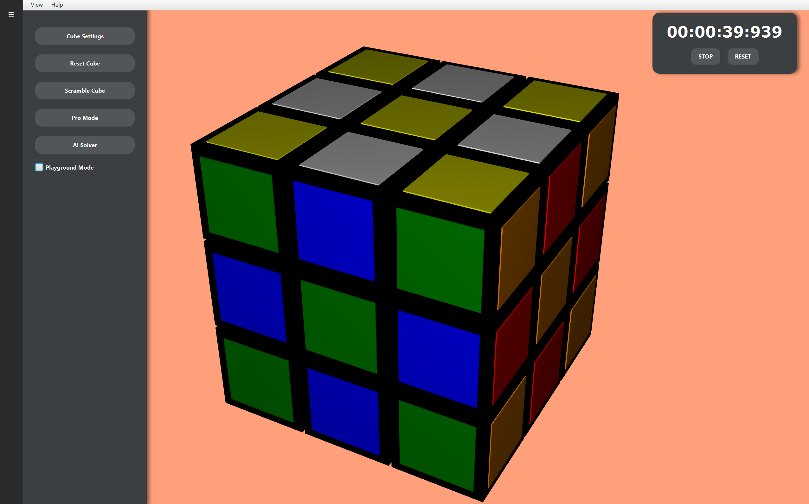

# 3D Rubik's Cube & AI Solver
A fully interactive 3D Rubik's Cube built with **JavaFX**, featuring a self-learning **AI Solver** using Q-Learning.

## 🚀 Features
* **Interactive 3D UI:** Rotate faces using keyboard shortcuts (R, L, U, D, F, B).
* **AI Solver:** A Q-Learning agent that trains itself to solve the cube.
* **Pro Mode:** Includes an "Observation Phase" and a high-accuracy stopwatch.
* **Visual Effects:** Smooth animations and celebratory confetti upon solving.

## 🛠️ Built With
* [Java](https://www.oracle.com/java/) - Core logic and OOP structure.
* [JavaFX](https://openjfx.io/) - 3D rendering and UI components.
* [Maven](https://maven.apache.org/) - Dependency management.

## 🧠 The AI Logic
The solver currently uses a hashmap **Q-Table** to map cube states to optimal moves.
It tracks 54 stickers to generate a unique state string and
rewards itself for reaching the solved state. (Currently able to accurately solve up 6 faces)
(Working on implementing a neural network for better memory efficiency and to 
move towards being able to solve a fully scrambled state)